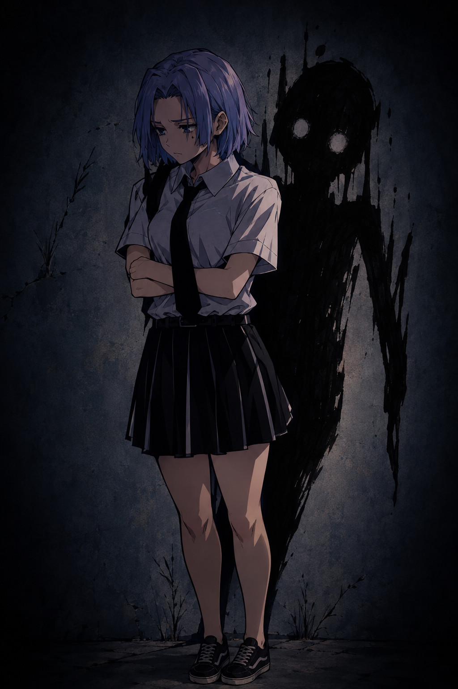

# D²L: As Aventuras de Diana, Dena e Lacey

## Seja bem vindo ao arquivo digital de D²L! 🎀​​💜​➡️​

    

Acompanhe o dia-a-dia das três meninas, Diana, Dena e Lacey e se emocione com o cotidiano das garotas.

* Momentos
* Memórias
* Conflitos
* Situações engraçadas
* E muito mais

## Personalidade
Fichas completas sobre cada personagem:

### 🎀 Diana
Representa **emoção, amor e gentileza.** Ela sente tudo intensamente e quer viver tudo.

### 💜​ Dena
Representa a **lógica, pensamento e proteção.** Ela é fria, séria, e observa e detecta o perigo de uma situação, sempre planejando.

### ➡️​ Lacey
Representa **movimento, espontaneidade e execução.** Lacey é a ponte de Diana e Dena para o mundo, e é a mais nova porta das duas para deixarem de apenas olhar o mundo, para sim começar a vive-lo.

**E juntas, elas vivem em harmonia.**

## Conflito de Dena x Lacey ⚔️​
Dena, em algum momento, vai precisar estar pronta para **soltar Diana para o mundo**; de não ter mais medo.

E Lacey é forma de prepara-la para isso, mas ela é a força oposta de Dena:

* Dena quer guardar e proteger Diana, para que Diana não seja fria como ela.
* Lacey quer liberar e deixar Diana expor seu amor para o mundo.

E ai, quando Lacey entra na relação das duas e "rouba" Diana, Dena pensa:

> "Quem ela pensa que é?"

> "Ela está estragando minha irmã."

Mas essa nunca foi a intenção de Lacey.
A intenção de Lacey é justamente outra - o que ela disse:

    <i>"Apenas façam. Vocês tem potêncial de viver tudo."</i>

    

        <b>Potêncial 🌹​.</b>
    

    

**Potêncial de viver tudo o que elas quiserem.**

É disso que Lacey está falando.

Mas também é disso que Dena também sente medo.

E muitas das tramas vão envolver tanto essa rivalidade, quanto
também esse amadurecimento.

## Dena e a Sombra 👥​

Dena tem uma camada muito importante: ela carrega algo **escuro e profundo.**

Ao mesmo tempo em que Dena é uma mulher forte, séria e muito responsável, **ela também se cobra muito e sente que sempre deve estar entregando algo para ter valor.**

E ai, sua prevenção e lógica (ilógica), começam a **machucar ela mesma.**

    

Dena passa a achar:

* Que sua preocupação não tem valor
* Que ela é chata, irrelevante - **que só diz coisas insignificantes**
* Que ela é feia
* Que nunca vai ser amada
* Que sua vida não tem valor

. . .

E ela se isola, e a sombra cresce cada vez mais, tomando a vida e as pequenas coisas de Dena.

*Mas quem consegue fazer Dena ver cor pela vida novamente?*

**Diana.**

Diana é o **sol** de Dena.

E Diana mostra para Dena o valor da vida:
* Uma musica bonita
* Um sorriso iluminado
* Uma comida gostosa
* Um abraço quentinho
* Um filme numa tarde chuvosa
* Um sorvete num dia ensolarado

Assim como a Dena é a **lua** de Diana.

E é por isso também que Dena se preocupa em manter Diana segura.

**Para que Diana não tenha uma sombra como ela.**

